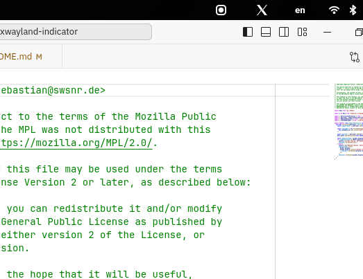

# XWayland GNOME shell extension

[](https://extensions.gnome.org/extension/6676/xwayland-indicator/)
[](https://github.com/swsnr/gnome-shell-extension-xwayland-indicator/releases/)
[](https://github.com/swsnr/gnome-shell-extension-xwayland-indicator/actions)

Point out X11 windows in GNOME.



This small GNOME extension shows the X11 logo in the panel if the current session uses X11 instead of wayland or if the currently focused window used xwayland.

## Install

Install from [extensions.gnome.org](https://extensions.gnome.org/extension/6676/xwayland-indicator/).

**Note**: The mandatory review process for extensions.gnome.org can sometimes delay releases for a few days, in particular if the release contains larger changes.
Please do be patient, or use release file (see below) as an alternative.

Or download the latest ZIP file from [releases](https://github.com/swsnr/gnome-shell-extension-xwayland-indicator/releases),
and install with

```console
$ gnome-extensions install xwayland-indicator@swsnr.de.shell-extension.zip
```

## License

Copyright Sebastian Wiesner <sebastian@swsnr.de>

This program is subject to the terms of the Mozilla Public
License, v. 2.0.If a copy of the MPL was not distributed with this
file, You can obtain one at https://mozilla.org/MPL/2.0/.

Alternatively, this program may be used under the terms
of the GNU General Public License Version 2 or later, as described below:

This program is free software; you can redistribute it and/or modify
it under the terms of the GNU General Public License as published by
the Free Software Foundation; either version 2 of the License, or
(at your option) any later version.

This program is distributed in the hope that it will be useful,
but WITHOUT ANY WARRANTY; without even the implied warranty of
MERCHANTABILITY or FITNESS FOR A PARTICULAR PURPOSE. See the
GNU General Public License for more details.
