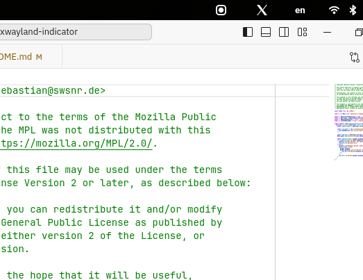

# XWayland GNOME shell extension

[](https://extensions.gnome.org/extension/6676/xwayland-indicator/)


Point out X11 windows in GNOME.



This small GNOME extension shows the X11 logo in the panel if the current session uses X11 instead of wayland or if the currently focused window used xwayland.

## Install

Install from [extensions.gnome.org](https://extensions.gnome.org/extension/6676/xwayland-indicator/).

**Note**: The mandatory review process for extensions.gnome.org can sometimes delay releases for a few days, in particular if the release contains larger changes.
Please do be patient, or use release file (see below) as an alternative.

Or download the latest ZIP file from [releases](https://codeberg.org/swsnr/gnome-shell-extension-xwayland-indicator/releases),
and install with

```console
$ gnome-extensions install xwayland-indicator@swsnr.de.shell-extension.zip
```

## License

Copyright Sebastian Wiesner <sebastian@swsnr.de>

Licensed under the EUPL, see <https://interoperable-europe.ec.europa.eu/collection/eupl/eupl-text-eupl-12>
